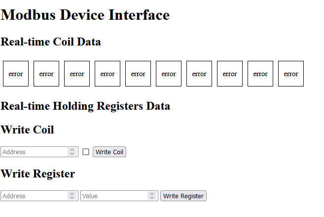
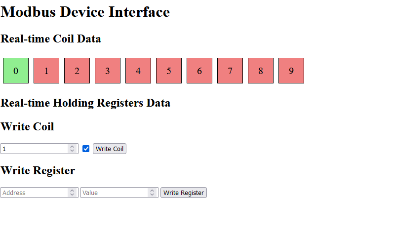
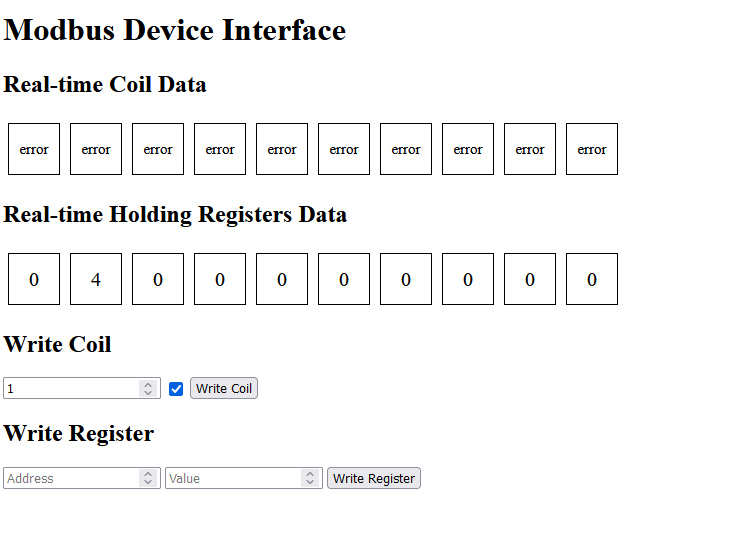

# modbus flask
simple web interface with fields to send data to modbus device + modbus tcp client reading coils and input registers constantly,

modbus client + flask server + websocket

tested with device simulator
## run app in terminal
python run.py
### Frontend
with no device

with device (only coils)

with device (only holding regs)
